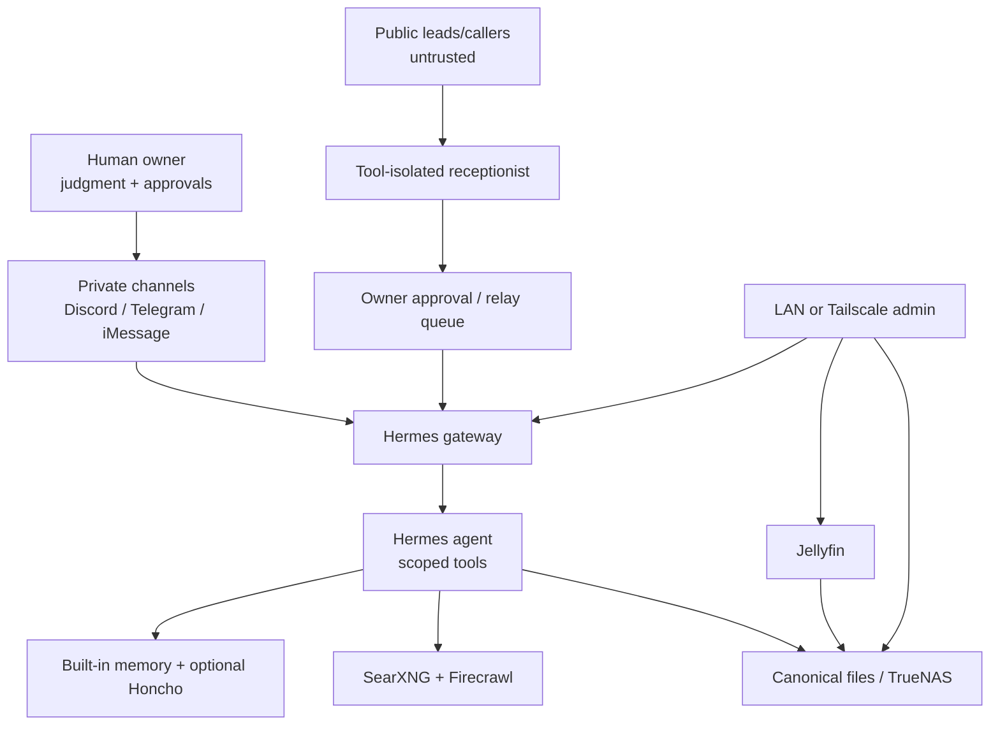

# Architecture

## Presence Engineering layers



## Hardware layouts

### Layout A — small repurposed box

```text
Debian/Ubuntu Server (bare metal)
├── Hermes (hosted/cloud model)
├── Jellyfin (direct play or Intel Quick Sync)
├── SearXNG / Firecrawl (optional; memory permitting)
└── local data disks + separate backup target
```

Why: the virtualization and ZFS memory tax can consume more value than Proxmox/TrueNAS provide on a small system.

### Layout B — capable virtualization host

```text
Proxmox VE (bare metal)
├── TrueNAS VM
│   └── passed-through HBA/controller or physical disks
├── Jellyfin Linux VM/LXC
│   └── Intel iGPU mapping for QSV/VA-API
├── Hermes Linux VM/LXC
│   └── hosted model; 64K+ context provider
└── Services VM/LXC
    └── SearXNG / Firecrawl / monitoring

Separate always-on Mac
└── BlueBubbles + Messages.app
```

## Storage boundary

- TrueNAS is a storage appliance first.
- Proxmox is the hypervisor first.
- Jellyfin consumes media storage; it should not own the storage control plane.
- Hermes consumes files through narrow shares or mounted project directories; it should not receive unrestricted storage-admin credentials.
- Backups must be independent of the pool and periodically restored in a test.

## Messaging boundary

A private owner's Hermes can have powerful tools. A public receptionist cannot.

```text
Unknown sender → bounded FAQ/intake model → structured summary → owner queue
Owner approval → privileged Hermes action (if needed)
```

BlueBubbles is free/open source but requires an always-on Mac signed into Messages. Use a separate Apple identity and line when the agent represents a business or separate persona. Do not share another person's Apple or ChatGPT login.

## Model boundary

- A hosted model makes Hermes lightweight; most CPU/RAM use is orchestration, tools, browser, and local services.
- A local model changes the project completely. Hermes currently expects at least a 64K context model; useful local tool-calling at that context can require substantial RAM/VRAM.
- Do not promise local frontier-model performance from a small server box.
- Image generation for a human in ChatGPT and image generation through an agent/API are separate billing/auth surfaces unless the configured provider explicitly supports both.
